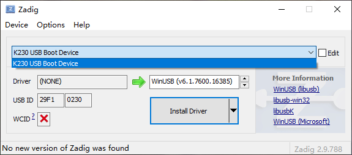
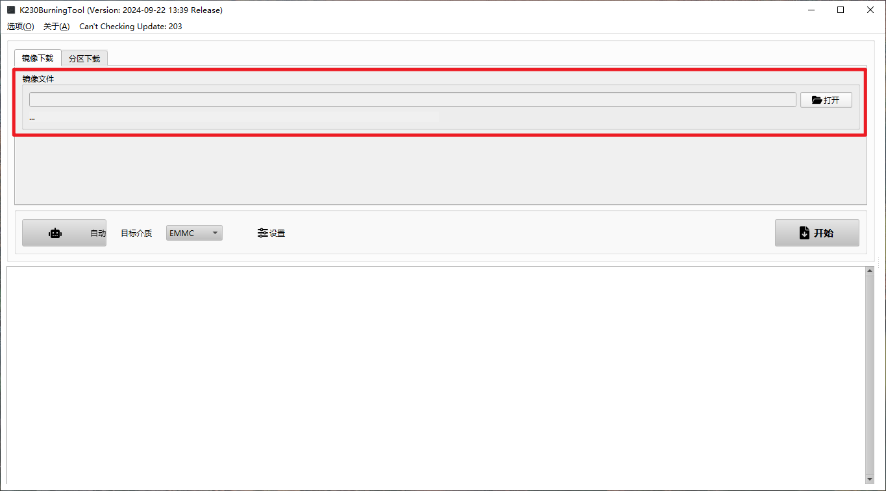
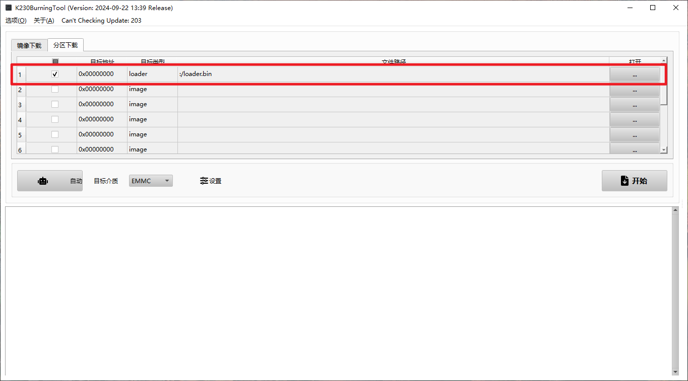
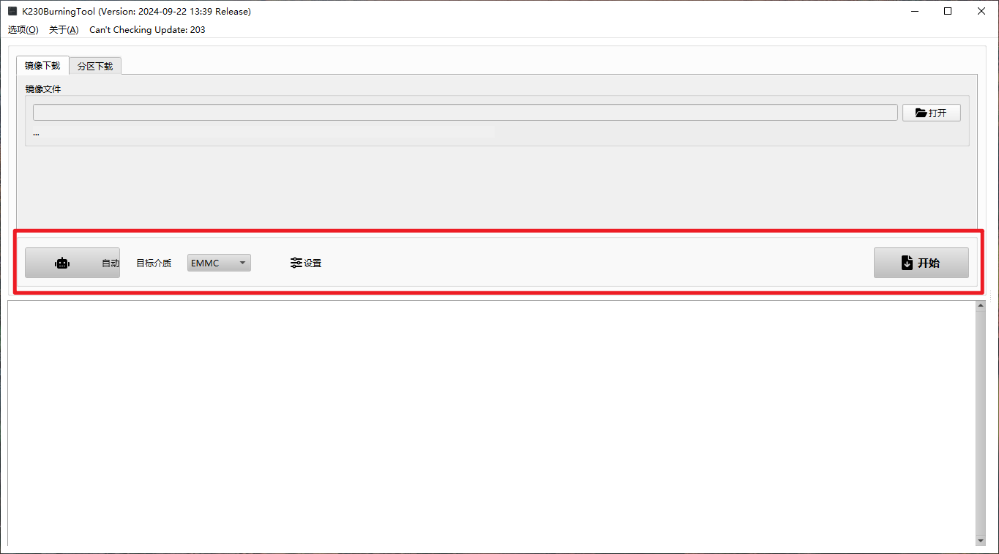
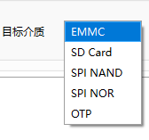

# K230 Burning Tool 使用说明

## 1. 驱动安装

如果烧录工具无法识别设备，请检查设备管理器中是否有未识别的 `K230 USB Boot Device`。如图所示：

遇到这种情况，需要使用 [Zadig](https://zadig.akeo.ie/) 工具为 `K230 USB Boot Device` 安装驱动。具体操作如下图：

## 2. 烧录使用流程

1. **选择烧录文件**：可以选择镜像烧录，或者指定分区文件和偏移值。
2. **设置目标介质**：根据板子的存储介质，选择对应的接口类型。
3. **插入板子**：按住板子上的 `BOOT` 按键，使其进入 `BootROM` 模式，然后插入板子。
4. **开始烧录**：点击**开始**按钮，开始烧录镜像。

### 镜像下载

在烧录时，需要选择符合要求的镜像文件，如 `*.img` 或 `*.kdimg` 文件：

### 分区下载

如果要进行分区下载，必须选择一个 `loader` 类型的文件，并至少选择一个 `image` 类型的文件，同时设置其偏移值：

## 3. 下载选项

### 目标介质

选择合适的存储介质类型，K230 支持五种存储介质：

- **EMMC**: 接在 `K230 SDIO0` 接口的 EMMC 或 SD 卡。
- **SD 卡**: 接在 `K230 SDIO1` 接口的 EMMC 或 SD 卡。
- **SPI NAND**: 连接在 `SPI` 总线上的 NAND Flash。
- **SPI NOR**: 连接在 `SPI` 总线上的 NOR Flash。
- **OTP**: 芯片内置的 OTP 设备。

### 开始

点击**开始**按钮后，工具会寻找以及等待 `K230 USB Boot Device` 连接。需要注意，目前工具仅支持从 `BootROM` 设备直接烧录，不支持从 `U-Boot` 设备烧录。

> 注意：不同介质的烧录流程可能略有不同，请根据具体情况进行调整。

### 小技巧

有些板子可能没有引出的 `BOOT` 按键，此时可以在上电前移除存储介质，待上电后再插入存储介质，这样也可以使板子进入 `BootROM` 模式。
