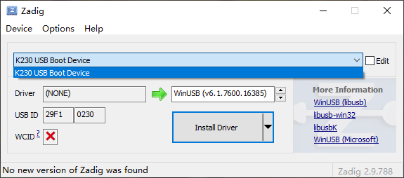
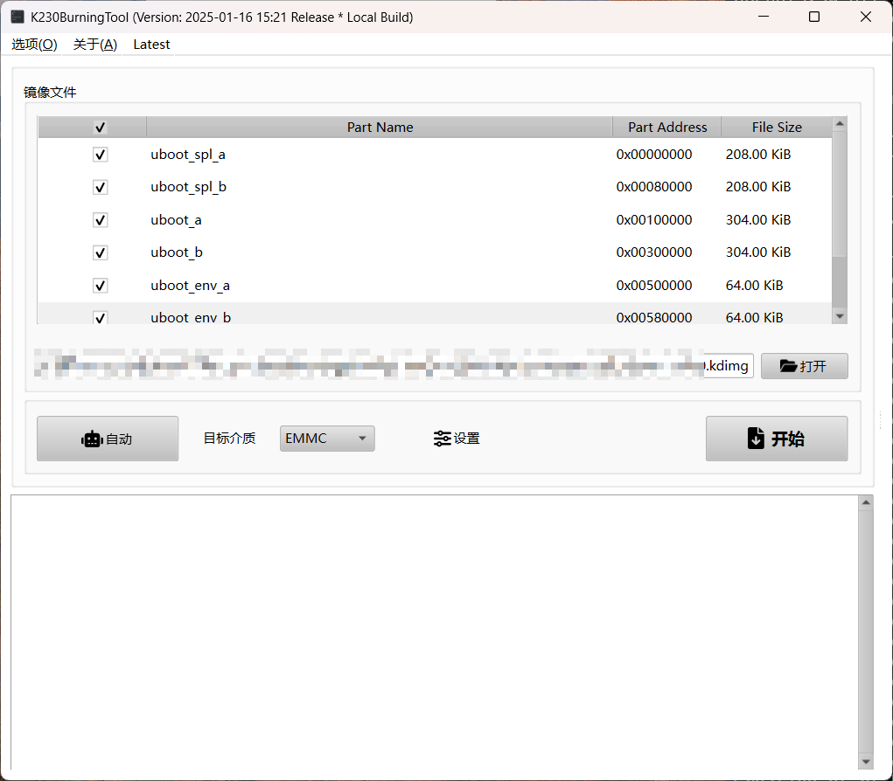
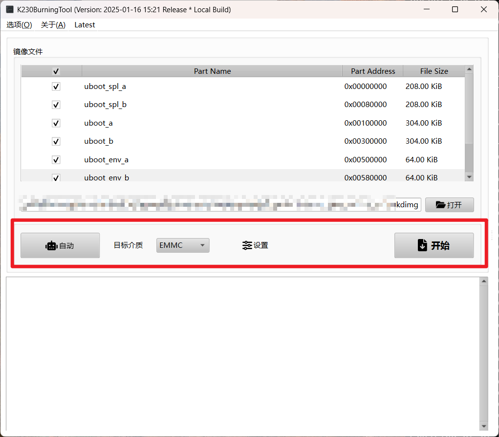
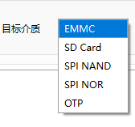
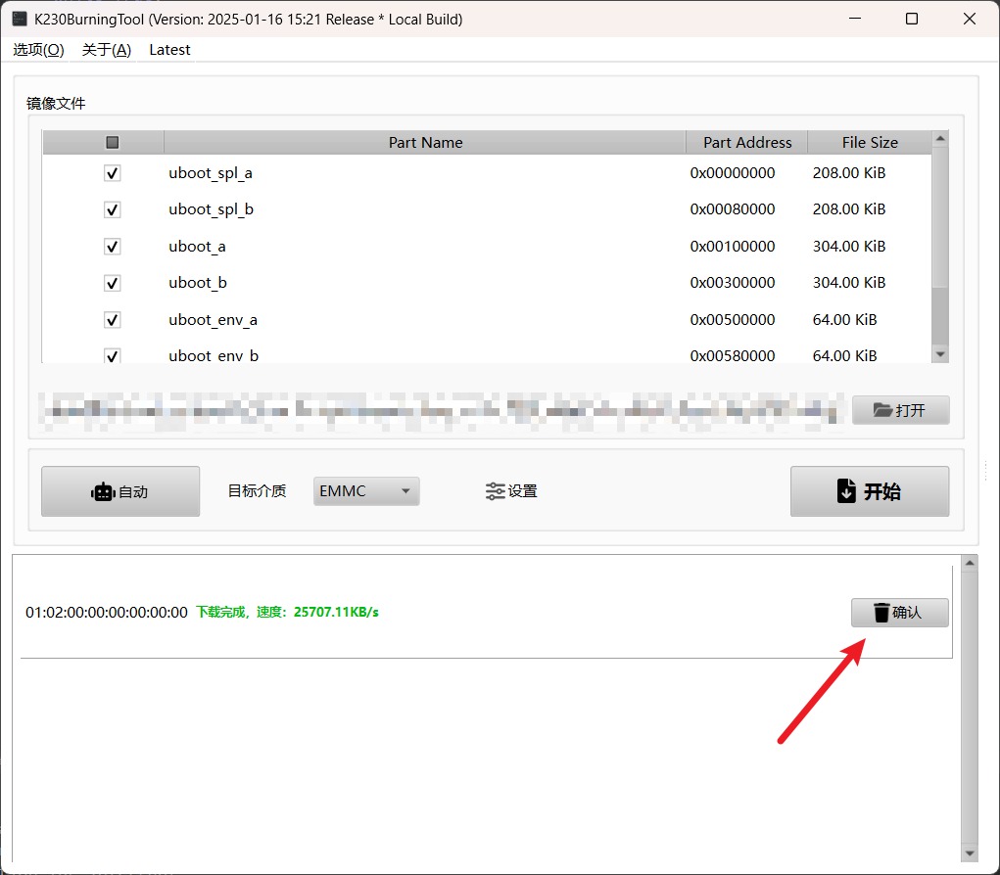

# K230 Burning Tool 使用说明

## 1. 驱动安装

如果烧录工具无法识别设备，请检查设备管理器中是否有未识别的 `K230 USB Boot Device`。如图所示：


遇到这种情况，需要使用 [Zadig](https://zadig.akeo.ie/) 工具为 `K230 USB Boot Device` 安装驱动。具体操作如下图：



## 2. 烧录使用流程

1. **选择烧录文件**：选择需要烧录的镜像，支持 `*.kdimg` ，以及其他格式（`*.img` 或者 `*.bin` 等等）。
2. **设置目标介质**：根据板子的存储介质，选择对应的接口类型。
3. **插入板子**：按住板子上的 `BOOT` 按键，使其进入 `BootROM` 模式，然后插入板子。
4. **开始烧录**：点击**开始**按钮，开始烧录镜像。
5. **点击确认**：烧录完毕之后，需要点击确认才可选择其他镜像文件或者再次烧录

### 镜像下载

在烧录时，需要选择符合要求的镜像文件，如 `*.img` 或 `*.kdimg` 文件：



> `*.kdimg` 包含分区信息，可选择下载指定分区

## 3. 下载选项



### 目标介质

选择合适的存储介质类型，K230 支持五种存储介质：



- **EMMC**: 接在 `K230 SDIO0` 接口的 EMMC 或 SD 卡。
- **SD 卡**: 接在 `K230 SDIO1` 接口的 EMMC 或 SD 卡。
- **SPI NAND**: 连接在 `SPI` 总线上的 NAND Flash。
- **SPI NOR**: 连接在 `SPI` 总线上的 NOR Flash。
- **OTP**: 芯片内置的 OTP 设备。

### 开始

点击**开始**按钮后，工具会寻找以及等待 `K230 USB Boot Device` 连接。

> 注意：不同介质的烧录流程可能略有不同，请根据具体情况进行调整。

### 点击确认

烧录完成之后，点击确认即可再次烧录。



### 小技巧

有些板子可能没有引出的 `BOOT` 按键，此时可以在上电前移除存储介质，待上电后再插入存储介质，这样也可以使板子进入 `BootROM` 模式。

## 4. 发布构建

三个桌面平台共用仓库根目录下的一个发布脚本：

```bash
./release.sh
```

脚本会分别构建普通版和 Avalon Nano 3 版，执行对应平台的 CMake
安装检查，并为每个产物生成 `.sha256`。Linux 手工发布产物是包含完整
Qt 运行库的 `.tar.gz`；GitHub Actions 还会收集安装阶段生成的
AppImage。AppImage 在无法使用 FUSE 的环境中可以这样运行：

```bash
./K230BurningTool-x86_64.AppImage --appimage-extract-and-run
```

macOS 正式发布需要 Developer ID Application 签名：

```bash
MACOS_SIGN_IDENTITY="Developer ID Application: Example (TEAMID)" \
  ./release.sh
```

如需同时公证，先用 `notarytool store-credentials` 创建钥匙串配置，再设置
`MACOS_NOTARY_PROFILE`。CI 的 macOS 构建用于跨平台验证，文件名中带有
`unsigned`；正式分发应使用本机签名后的 DMG。
